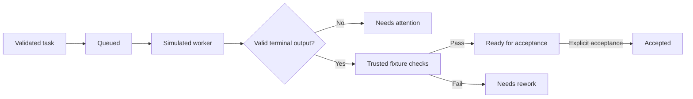

# XVANT

Original local agent harness. Phase 2 adds durable SQLite state, supervised simulated workers, process checks, an authenticated loopback API, and verified snapshots. The default demos make no model calls; the explicitly approved OpenCode live probe below does.

## Run

Install Node **24.21.0** and npm **12.0.2**, then run from this directory:

```sh
npm ci --ignore-scripts
npm run demo
npm run demo -- quota
npm run demo:durable
npm run gate -- --phase 02 --offline
```

On this Windows workstation, an isolated Node binary is available. Use it for the current PowerShell session:

```powershell
$env:PATH = "$PWD/.tools/node_modules/node-win-x64/bin;$PWD/.tools/node_modules/.bin;$env:PATH"
node --version
npm run gate -- --phase 02 --offline
```

The local `.tools` directory is ignored and is not required on another machine. Use the pinned Node version there. If a managed Windows trust store is needed for package installation, set `NODE_USE_SYSTEM_CA=1`; certificate verification stays enabled.

## What Phase 1 does

- Validates task, attempt, worker, event, and evidence contracts with Zod.
- Keeps work revisions separate from state versions. Missing, failed, duplicated, or stale check receipts cannot approve work.
- Rejects duplicate worker IDs, aliases, and native session identities.
- Validates dependency DAGs independently of parent hierarchies: up to 20 nodes and three hierarchy levels. Lower limits are supported.
- Runs success, failure, delayed, malformed, quota, and unknown simulation scenarios.
- Reserves one turn per worker. A stream must obey task/attempt identity, event order, size limits, and one terminal outcome.
- Runs host-registered verification callbacks. Worker output cannot supply trusted receipts. Success reaches `ready_for_acceptance`; an explicit controller `accept` call is still required.
- Generates `docs/evidence/G01.json`, logs, a source manifest, suite counts, and coverage. Missing/skipped/failed tests fail the gate.



## Phase 2 and boundaries

`npm run demo:durable` executes a simulated worker in a child process, runs a host-registered process check, reopens the database, accepts persisted evidence, and verifies a backup/restore. Its temporary fixture is removed afterward. No listener or worker remains running.

Programmatic service entry: `startService(localStateDirectory, trustedChecks)` in `apps/controller/src/service.ts`. It returns the loopback origin, one-use bootstrap token, and a close method. The host delivers that token privately; never put it in a URL or log it. There is no UI yet.

Simulation hashes do not prove real code changes. Workspace IDs reserve logical resources; they do not isolate filesystem access. Restricted profiles fail closed: Windows taskkill/Linux process groups are not hostile-code containment. Unknown operations retain reservations until trusted reconciliation. Mixed live providers, subscriptions, Linux runtime qualification, and real repository attestation remain unverified.

Use local nonsynchronized storage. Snapshots restore into new directories only and preserve the controller lease TTL. Verify snapshots before recovering user data.

## Phase 3 offline foundation

`npm run probe -- --offline --runtime all` exercises ten synthetic provider
identities. `npm run probe -- --inventory-only --runtime all` reads CLI versions
without model calls. `npm run gate -- --phase 03 --offline` verifies the offline
foundation and all earlier suites. Those controllers reject live dispatch; this does not
complete the live Phase 3 milestone. See [adapter boundaries](packages/adapters/README.md).

## Phase 4 context and handoffs

Workers receive focused context through sealed packets, not raw transcripts.
`npm run gate -- --phase 04 --offline` runs every earlier suite and fixture plus the
Phase 4 suites and a handoff fixture. In that fixture, a Codex-named worker hands a
partly finished task to a Claude-named simulated worker in a separate process.
The recipient sees only the packet and must complete the task from it. No model
calls are made; the live handoff gate remains open.

- **Packets** (`packages/context/src/packet.ts`) carry the objective, acceptance
  criteria, revisions, recipient, write ownership, tools, skills and sourced items.
  The objective, criteria, policy and required items are never truncated: an
  oversized packet fails so the task can be split. Optional items enter whole by
  priority. Token counts are conservative byte-based estimates. Every packet has a
  hash seal that recipients verify.
- **Retrieval** (`retrieval.ts`) uses Git ignore rules (with repository fsmonitor
  programs disabled) or a bounded walk. It never opens secret-named files
  (`.env*`, keys, `.npmrc`, `.ssh/` and similar), drops credential-shaped content,
  refuses links, binary and oversized files, and ranks with SQLite FTS5.
  Detection is defense in depth, not a guarantee.
- **Memory** (`packages/storage/src/memory.ts`, schema v3) holds namespaced records
  with provenance. Workers can only propose, bound to their task's current
  attempt; acceptance, rejection and supersession are explicit. Reads are scoped
  to one project. Records anchored to files become stale when those files change
  (`packages/memory`), and stale, unaccepted, rejected or cross-project records
  never enter a packet.
- **Handoffs** (`handoff.ts`) copy requirements from the task record, keep exact
  revisions, remaining work, failed attempts, questions and artifact hashes, and
  make every fact a required packet item.
- **Inspection** (`inspect.ts`) explains why each candidate was included or
  omitted, without copying content.
- **Import and export** (`transfer.ts`) move accepted memory as sealed bundles.
  Imports become proposals, never accepted records. External transcripts are
  read without modification and stored as artifacts.

## Phase 5 tools and skills

`npm run gate -- --phase 05 --offline` runs everything through Phase 4 plus the
Phase 5 suites, a hostile-worker fixture behind the MCP bridge, the compatibility
report and a real-browser check. A host without a Chromium browser reports the
browser check as unavailable, which fails the gate rather than passing it.

- **Tools** (`packages/tools`): `file.read`, `file.apply_patch`, `repo.search`,
  `git.inspect`, `command.run`, `test.run`, `artifact.publish`,
  `agent.read_result`, `agent.request_work`, `memory.search`, `memory.propose` and
  `browser.inspect`. Every call passes one gate: the task catalog, the permission
  profile's effect classes, and for process actions an approval bound to the exact
  action hash. Results are schema-checked, size-capped and receipted. Workspace
  paths cannot escape, follow links, reach `.git` or secret files, or write outside
  owned paths. Patches name the hash they were based on. Git inspection never runs
  repository-configured programs. Commands never go through a shell.
- **MCP bridge** (`mcp.ts`): one authenticated loopback endpoint per task attempt
  exposes only that task's catalog to an external runtime.
- **Skills** (`skills/`, `packages/skills`): ten original skills with hashed
  instructions, exact-version dependencies, declarative hooks and fixtures. Skills
  cannot grant tools or permissions; selected skills are pinned by hash for the
  life of a task. Every fixture's check fails on the untouched repository and
  passes with its reference solution.
- **Native-tool bypass**: Codex, Claude Code and OpenCode run their own shell,
  edit and web tools outside XVANT. None of their restriction mechanisms is
  live-tested, so read-only profiles are blocked on them, and trusted-local needs
  an explicit acknowledgement. `node scripts/compatibility-report.mjs` prints the
  full skill × runtime × profile matrix.
- **Browser** (`browser.inspect`): a host-registered Chromium browser, a new
  temporary profile per call, loopback origins only, and every other request
  blocked through DevTools. This is defense in depth for trusted local pages, not
  a network sandbox.

## Layout

| Path                              | Responsibility                                      |
| --------------------------------- | --------------------------------------------------- |
| `packages/contracts`              | Validated boundary schemas and typed errors         |
| `packages/core`                   | Pure transitions, evidence consistency, graph rules |
| `packages/adapters/src/simulated` | Deterministic simulation and fault fixtures         |
| `packages/context`                | Packets, retrieval, handoffs, inspection, transfer  |
| `packages/memory`                 | Memory freshness and packet conversion              |
| `packages/tools`                  | Tool registry, tools, MCP bridge, browser           |
| `packages/skills`                 | Skill catalog, pinning, hooks, compatibility        |
| `skills`, `fixtures/skills`       | Original skills and their evaluation fixtures       |
| `apps/controller`                 | In-memory orchestration and runnable demo           |
| `scripts`                         | Offline gate and test-report validation             |
| `tests`                           | Gate-policy tests                                   |
| `docs/evidence`                   | Compatibility decisions and gate results            |

Run `npm test`, `npm run typecheck`, `npm run lint`, or `npm run format:check` for individual checks. Run the gate on each host to qualify that host.

## Durable OpenCode live integration

`LiveOpenCodeController` supports explicitly approved, trusted-local text turns with OpenCode **2.0.19** and **opencode/big-pickle**. It journals native session creation before spawning the CLI, atomically reserves the returned session ID, journals inference, validates the JSON stream, runs host-registered checks against stable workspace snapshots, and prepares evidence for explicit acceptance. Accepted sessions can resume within the same project, workspace, host, and account. Recovery retains uncertain reservations and never replays a prompt automatically.

Run the opt-in qualification with the installed executable:

```powershell
npm run probe:live:opencode -- --approve-live --executable "C:\Users\jiang\AppData\Local\hermes\node\node_modules\@opencode\cli\bin\opencode.exe"
```

This runs two real model turns, checks token recall on the same native session, reopens SQLite before each explicit fixture acceptance, and writes `docs/evidence/G03-opencode-live.json`. State and workspace artifacts remain under `.artifacts/opencode-live-*`. No paid fallback is configured. This provider-specific receipt does not complete the mixed-provider live G03 milestone.

The CLI inherits standard OpenCode configuration and permissions; it is not sandboxed. No automatic permission approval is supplied. Tool events and unknown output fail the text protocol, but rejecting an event cannot undo a tool already run. Use only trusted local workspaces. A controller permits one active run at a time. Interrupts, timeouts, and uncertain shutdown retain reservations for trusted reconciliation. The HTTP and offline fixture controllers remain separate and cannot qualify live evidence.
