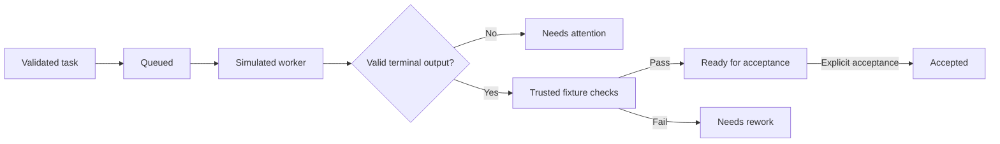

# XVANT

Original local agent harness. Phase 1 supplies an offline domain model, bounded task graphs, deterministic simulated workers, and an in-memory controller. It makes no model calls.

## Run

Install Node **24.21.0** and npm **12.0.2**, then run from this directory:

```sh
npm ci --ignore-scripts
npm run demo
npm run demo -- quota
npm run gate -- --phase 01 --offline
```

On this Windows workstation, an isolated Node binary is available. Use it for the current PowerShell session:

```powershell
$env:PATH = "$PWD/.tools/node_modules/node-win-x64/bin;$PWD/.tools/node_modules/.bin;$env:PATH"
node --version
npm run gate -- --phase 01 --offline
```

The local `.tools` directory is ignored and is not required on another machine. Use the pinned Node version there. If a managed Windows trust store is needed for package installation, set `NODE_USE_SYSTEM_CA=1`; certificate verification stays enabled.

## What Phase 1 does

- Validates task, attempt, worker, event, and evidence contracts with Zod.
- Keeps work revisions separate from state versions. Missing, failed, duplicated, or stale check receipts cannot approve work.
- Rejects duplicate worker IDs, aliases, and native session identities.
- Validates dependency DAGs independently of parent hierarchies: up to 20 nodes and three hierarchy levels. Lower limits are supported.
- Runs success, failure, delayed, malformed, quota, and unknown simulation scenarios.
- Reserves one turn per worker. A stream must obey task/attempt identity, event order, size limits, and one terminal outcome.
- Runs host-registered verification callbacks. Worker output cannot supply trusted receipts. Success reaches `ready_for_acceptance`; an explicit controller `accept` call is still required.
- Generates `docs/evidence/G01.json`, logs, a source manifest, suite counts, and coverage. Missing/skipped/failed tests fail the gate.



## Boundaries

The demo checks synthetic artifact hashes; it does not build or review real code. All runtime events are labeled simulated. Controller state is lost on exit. Real provider adapters, shared context, persistence, process supervision, a UI, and production tools belong to later phases. No subscription or API access has been qualified here.

A worktree is not a security sandbox. The in-memory controller and verifier callbacks are trusted code inside one process. Phase 2 will add durable state and execution boundaries; this phase is not a service intended for untrusted network clients.

## Layout

| Path                              | Responsibility                                      |
| --------------------------------- | --------------------------------------------------- |
| `packages/contracts`              | Validated boundary schemas and typed errors         |
| `packages/core`                   | Pure transitions, evidence consistency, graph rules |
| `packages/adapters/src/simulated` | Deterministic simulation and fault fixtures         |
| `apps/controller`                 | In-memory orchestration and runnable demo           |
| `scripts`                         | Offline gate and test-report validation             |
| `tests`                           | Gate-policy tests                                   |
| `docs/plans`                      | Phased implementation and release criteria          |
| `docs/evidence`                   | Compatibility decisions and gate results            |

Run `npm test`, `npm run typecheck`, `npm run lint`, or `npm run format:check` for individual checks. CI is configured for Windows and Linux; its configuration is not proof that remote jobs have run.
