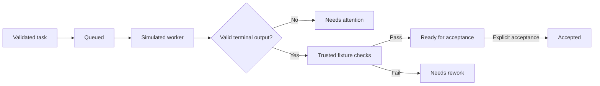

# XVANT

Original local agent harness. Phase 2 adds durable SQLite state, supervised simulated workers, process checks, an authenticated loopback API, and verified snapshots. It makes no model calls.

## Run

Install Node **24.21.0** and npm **12.0.2**, then run from this directory:

```sh
npm ci --ignore-scripts
npm run demo
npm run demo -- quota
npm run demo:durable
npm run gate -- --phase 02 --offline
```

On this Windows workstation, an isolated Node binary is available. Use it for the current PowerShell session:

```powershell
$env:PATH = "$PWD/.tools/node_modules/node-win-x64/bin;$PWD/.tools/node_modules/.bin;$env:PATH"
node --version
npm run gate -- --phase 02 --offline
```

The local `.tools` directory is ignored and is not required on another machine. Use the pinned Node version there. If a managed Windows trust store is needed for package installation, set `NODE_USE_SYSTEM_CA=1`; certificate verification stays enabled.

## What Phase 1 does

- Validates task, attempt, worker, event, and evidence contracts with Zod.
- Keeps work revisions separate from state versions. Missing, failed, duplicated, or stale check receipts cannot approve work.
- Rejects duplicate worker IDs, aliases, and native session identities.
- Validates dependency DAGs independently of parent hierarchies: up to 20 nodes and three hierarchy levels. Lower limits are supported.
- Runs success, failure, delayed, malformed, quota, and unknown simulation scenarios.
- Reserves one turn per worker. A stream must obey task/attempt identity, event order, size limits, and one terminal outcome.
- Runs host-registered verification callbacks. Worker output cannot supply trusted receipts. Success reaches `ready_for_acceptance`; an explicit controller `accept` call is still required.
- Generates `docs/evidence/G01.json`, logs, a source manifest, suite counts, and coverage. Missing/skipped/failed tests fail the gate.



## Phase 2 and boundaries

`npm run demo:durable` executes a simulated worker in a child process, runs a host-registered process check, reopens the database, accepts persisted evidence, and verifies a backup/restore. Its temporary fixture is removed afterward. No listener or worker remains running.

Programmatic service entry: `startService(localStateDirectory, trustedChecks)` in `apps/controller/src/service.ts`. It returns the loopback origin, one-use bootstrap token, and a close method. The host delivers that token privately; never put it in a URL or log it. There is no UI yet.

Simulation hashes do not prove real code changes. Workspace IDs reserve logical resources; they do not isolate filesystem access. Restricted profiles fail closed: Windows taskkill/Linux process groups are not hostile-code containment. Unknown operations retain reservations until trusted reconciliation. Live providers, subscriptions, Linux runtime qualification, and real repository attestation remain unverified.

Use local nonsynchronized storage. Snapshots restore into new directories only and preserve the controller lease TTL. Verify snapshots before recovering user data.

## Layout

| Path                              | Responsibility                                      |
| --------------------------------- | --------------------------------------------------- |
| `packages/contracts`              | Validated boundary schemas and typed errors         |
| `packages/core`                   | Pure transitions, evidence consistency, graph rules |
| `packages/adapters/src/simulated` | Deterministic simulation and fault fixtures         |
| `apps/controller`                 | In-memory orchestration and runnable demo           |
| `scripts`                         | Offline gate and test-report validation             |
| `tests`                           | Gate-policy tests                                   |
| `docs/evidence`                   | Compatibility decisions and gate results            |

Run `npm test`, `npm run typecheck`, `npm run lint`, or `npm run format:check` for individual checks. Run the gate on each host to qualify that host.
